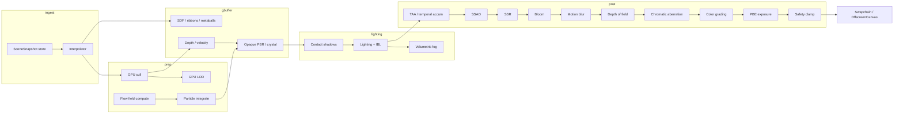

# Render Graph

## Topology (logical)



## Node contract

Each graph node:

```ts
interface RenderPassNode {
  id: string
  reads: AttachmentId[]
  writes: AttachmentId[]
  enabled: (tier: QualityTier, caps: DeviceCaps) => boolean
  execute: (ctx: FrameContext) => void
}
```

Nodes are registered by subsystem factories (`PostProcessing`, `Lighting`, …) and assembled by `Renderer.createGraph(tier)`.

## Stale snapshot discard

```text
onSnapshot(s):
  if s.sequence <= store.appliedSequence: drop++
  else store.pending = s
onFrame(dt):
  if store.pending: beginInterp(store.pending); store.pending = null
  interpolate(dt)  // never await fetch
```

## Minimal draws

Opaque procedural instances → 1–N instanced draws after cull buffer compact. Particles → single indirect/instanced draw. Post → fullscreen triangles only.
